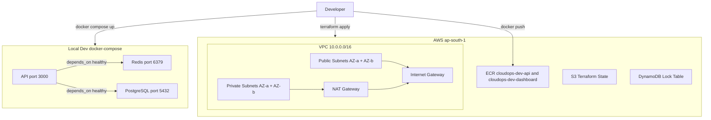

# Phase 1 — Foundation: Infrastructure & Containerisation

## Overview
Phase 1 establishes the AWS foundation and containerises the CloudOps Platform.
All infrastructure is provisioned via Terraform. Both services are containerised
using multi-stage Dockerfiles and pushed to ECR.

## Architecture



## What Was Built

### Phase 1A — AWS Infrastructure
- VPC with 2 public + 2 private subnets across 2 AZs
- Internet Gateway for public subnets
- NAT Gateway for private subnet outbound access
- IAM OIDC role for GitHub Actions (no long-lived keys)
- ECR repositories for api and dashboard with lifecycle policies
- S3 remote state + DynamoDB lock table for Terraform

### Phase 1B — Containerisation
- Multi-stage Dockerfile for API (node:20-alpine builder, non-root user)
- Multi-stage Dockerfile for Dashboard (node:20-alpine builder, nginx:alpine runtime)
- docker-compose.yml for local dev (api + redis + postgres with health checks)
- .dockerignore for both services
- Trivy image scan — CRITICAL: 0
- Both images pushed to ECR

## How to Run Locally

```bash
cd docker
docker compose up
curl http://localhost:3000/health
docker compose down
```

## Key Decisions

### Why multi-stage builds?
Stage 1 installs all dependencies and compiles. Stage 2 copies only the production
output. Dev dependencies never enter the final image — smaller image, smaller attack surface.

### Why non-root user in API container?
Running as root means a compromised process has root access inside the container.
Non-root user (appuser) limits blast radius of any exploit.

### Why nginx:alpine for dashboard?
React compiles to static HTML/CSS/JS. No Node.js needed at runtime.
nginx serves static files at ~23MB vs ~180MB for a Node image.

### Why NAT Gateway for private subnets?
Resources in private subnets need outbound internet access but must not be reachable
from the internet. NAT Gateway allows outbound-only access without exposing a public IP.

### Why OIDC instead of IAM access keys?
Long-lived access keys are a security risk. OIDC issues short-lived tokens (15 minutes)
tied to a specific GitHub repo. No secret to rotate, no key to leak.

## Trivy Scan Results
- Scan date: 2026-05-04
- Image: cloudops-api:latest
- CRITICAL: 0 ✅
- HIGH: 11 (npm dependencies, fixed versions available)
- Full report: docs/trivy-report.json

## Deliverables
| # | Deliverable | Status |
|---|-------------|--------|
| 1 | Terraform VPC module | ✅ Done |
| 2 | Terraform IAM module | ✅ Done |
| 3 | Terraform ECR module | ✅ Done |
| 4 | S3 remote state + DynamoDB lock | ✅ Done |
| 5 | Multi-stage Dockerfile — API | ✅ Done |
| 6 | Multi-stage Dockerfile — Dashboard | ✅ Done |
| 7 | docker-compose.yml | ✅ Done |
| 8 | Trivy scan — zero CRITICAL CVEs | ✅ Done |
| 9 | Phase 1 README with architecture diagram | ✅ Done |
